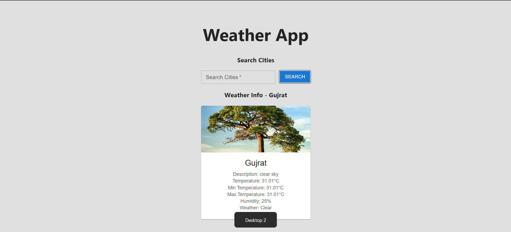

# 🌦️ React Weather App

A sleek and responsive **Weather Application** built with **React** and **Material UI**, powered by the **OpenWeatherMap API**.  
Search for any city across the globe and view live weather details such as **temperature, humidity, weather description, and conditions**, complete with dynamic weather images that change according to the forecast.

---

## 🖼️ App Preview



> 📸 Example: Weather data for *Gujrat* with live weather card and dynamic image.

---

## ✨ Features

- 🌍 **Global Weather Search** — Find weather info for any city worldwide.
- ⚡ **Live Weather Updates** — Powered by the OpenWeatherMap API.
- 🖼️ **Dynamic Weather Images** — Background image changes based on weather conditions (sunny, haze, rain, etc.).
- 🎨 **Modern UI** — Built using Material UI for a clean and minimal design.
- 🧠 **React Hooks** — Uses `useState` for real-time updates.
- 🚨 **Error Handling** — Handles invalid city names and failed API responses gracefully.

---

## 🛠️ Tech Stack

| Technology | Purpose |
|-------------|----------|
| ⚛️ React.js | Frontend Framework |
| 🎨 Material UI | UI Components |
| 🌐 OpenWeatherMap API | Weather and Geo data |
| 🧠 React Hooks | State management |
| 💾 JavaScript (ES6+) | Async data fetching and logic |

---

## 📁 Folder Structure
📦 weather-app
┣ 📂 src
┃ ┣ 📜 WeatherApp.jsx # Main parent component
┃ ┣ 📜 SearchBox.jsx # Handles city search & API requests
┃ ┣ 📜 InfoBox.jsx # Displays weather details and image
┃ ┣ 📜 index.js # App entry point
┃ ┗ 📜 App.css # Styles (optional)
┣ 📜 package.json
┣ 📜 README.md
┗ 📜 .gitignore


---

## ⚙️ Installation & Setup

Follow these steps to run the project locally 👇

### 1️⃣ Clone the Repository
```bash
git clone https://github.com/your-username/weather-app.git
cd weather-app

  ### 2️⃣ Install Dependencies
npm install

###m 3️⃣ Add Your OpenWeatherMap API Key

Create a .env file in the root of your project and add this line:

REACT_APP_WEATHER_API_KEY=your_api_key_here

### 4️⃣ Start the App
npm start


Then open http://localhost:3000
 to view the app in your browser 🚀

🌍 API References
🗺️ GeoCoding API

Fetches latitude and longitude for the entered city:
http://api.openweathermap.org/geo/1.0/direct?q={city}&limit=1&appid={API_KEY}

🖼️ **Dynamic Weather Images** — Background image changes based on weather conditions (sunny, haze, rain, etc.).
Weather	Display Image
☀️ Clear	Sunny sky
☁️ Clouds	Cloudy day
🌧️ Rain	Rainy atmosphere
🌫️ Haze / Mist / Fog	Foggy skyline
❄️ Snow	Snowy weather
⚡ Thunderstorm	Lightning storm
🏜️ Dust / Sand	Desert scene

Images are fetched dynamically from Unsplash API or predefined image URLs.

🚀 Future Enhancements

⏱️ 7-Day weather forecast

🕒 Display local time and timezone

🗺️ Interactive map with weather markers

🌗 Light/Dark theme toggle

🎞️ Animated weather transitions with Framer Motion

🧑‍💻 Author
Pranav Amale

GitHub:https://github.com/Pranavamale1/Weather-App.git

LinkedIn: https://www.linkedin.com/in/pranav-amale-210b2b342?utm_source=share&utm_campaign=share_via&utm_content=profile&utm_medium=android_app


